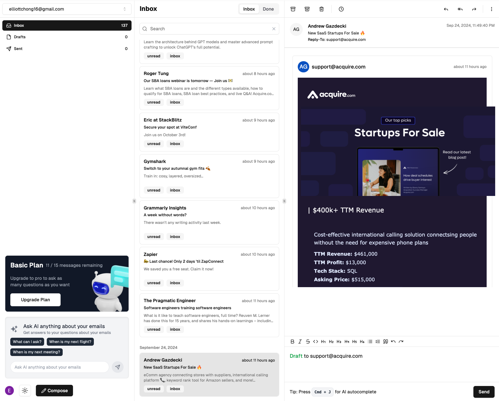

# GenMail - AI-Powered Email Client



## Overview

GenMail is a modern, AI-powered email client built with Next.js 14. It combines artificial intelligence with elegant design to transform your email experience. The application includes premium features accessible through a subscription model, with payments handled by Stripe.

## Features

- 🤖 **AI-Powered Assistant**: Smart email drafting and response suggestions
- ⌨️ **Command Palette**: Quick actions and navigation with keyboard shortcuts
- ✨ **Smart Categorization**: Automatic email organization and priority inbox
- ⚡ **Lightning Fast**: Optimized interface for rapid email management
- 🔒 **Privacy First**: End-to-end encryption and secure data handling
- ⏰ **Time Saving**: AI-powered automation for email management

## Tech Stack

### Frontend
- Next.js 14
- React
- TypeScript
- Tailwind CSS
- shadcn/ui
- Framer Motion

### Authentication & User Management
- Clerk

### Database & ORM
- PostgreSQL
- Prisma ORM
- Neon Database (Serverless)

### AI & Machine Learning
- OpenAI API
- OpenAI Edge

### State Management & Data Fetching
- TRPC
- Tanstack Query
- Jotai

### Payment Processing
- Stripe

### Development Tools
- ESLint
- Prettier
- TypeScript

## Getting Started

1. **Clone the repository**
   ```bash
   git clone https://github.com/yourusername/genmail.git
   cd genmail
   ```

2. **Install dependencies**
   ```bash
   npm install
   ```

3. **Set up environment variables**
   Create a `.env` file in the root directory with the following variables:
   ```env
   # Database
   DATABASE_URL="your_database_url"

   # Clerk Auth
   NEXT_PUBLIC_CLERK_PUBLISHABLE_KEY=
   CLERK_SECRET_KEY=

   # OpenAI
   OPENAI_API_KEY=

   # Stripe
   STRIPE_SECRET_KEY=
   STRIPE_WEBHOOK_SECRET=
   ```

4. **Initialize the database**
   ```bash
   npm run db:push
   ```

5. **Start the development server**
   ```bash
   npm run dev
   ```

6. Open [http://localhost:3000](http://localhost:3000) in your browser

## Project Structure

```
genmail/
├── src/
│   ├── app/           # Next.js app directory
│   ├── components/    # Reusable components
│   ├── lib/          # Utility functions and shared logic
│   ├── styles/       # Global styles
│   └── trpc/         # TRPC setup and procedures
├── prisma/           # Database schema and migrations
├── public/           # Static assets
└── ...
```

## Contributing

1. Fork the repository
2. Create your feature branch (`git checkout -b feature/AmazingFeature`)
3. Commit your changes (`git commit -m 'Add some AmazingFeature'`)
4. Push to the branch (`git push origin feature/AmazingFeature`)
5. Open a Pull Request

## License

This project is licensed under the MIT License - see the [LICENSE](LICENSE) file for details.

## Acknowledgments

- [Next.js](https://nextjs.org/)
- [Tailwind CSS](https://tailwindcss.com/)
- [shadcn/ui](https://ui.shadcn.com/)
- [Clerk](https://clerk.dev/)
- [OpenAI](https://openai.com/)
